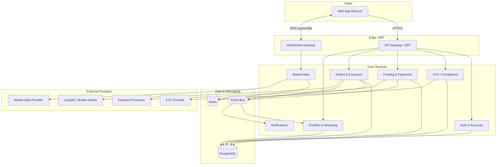
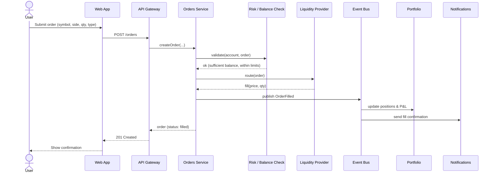
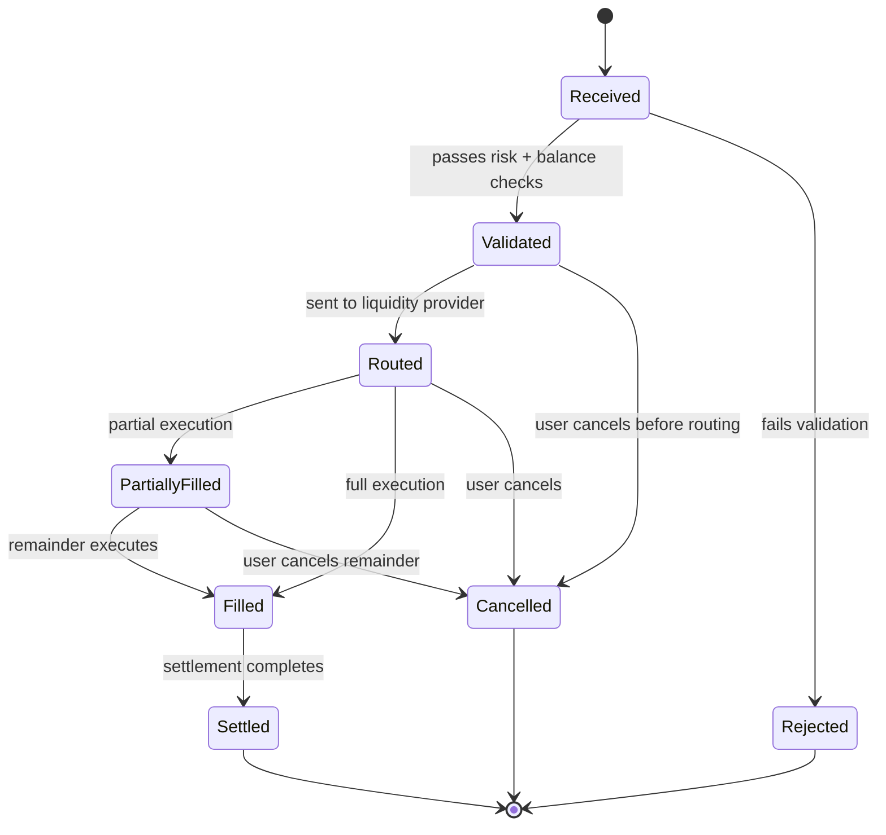

# Architecture

> Starting assumption: Brokly is an online brokerage platform. Validate against the real product
> before treating this as ground truth.

## Overview

Brokly is a service-oriented web application. A Next.js client talks to an API/BFF layer, which
fans out to focused backend services. Live data (quotes, order updates) flows over WebSockets.
Services own their data in PostgreSQL, share ephemeral state and streams in Redis, and coordinate
through an event bus. External providers handle market data, execution, payments, and KYC.

_Source: [`diagrams/system-architecture.mermaid`](./diagrams/system-architecture.mermaid)._

## Components

**Web App (Next.js).** Rendering, routing, and the trading UI. Holds no business logic beyond
presentation and optimistic updates. Subscribes to the WebSocket gateway for quotes and fills.

**API Gateway / BFF.** Single entry point for the client. Handles auth, request validation, rate
limiting, and composition across services so the client makes one call, not five.

**WebSocket Gateway.** Pushes live quotes and order/fill events to subscribed clients. Backed by
Redis pub/sub fed from the Market Data and Orders services.

**Auth & Accounts.** Identity, sessions, and account lifecycle (open, restrict, close).

**KYC / Compliance.** Wraps the external KYC provider, records verification status, and keeps an
audit trail. Gates funding and trading until an account is verified.

**Funding & Payments.** Deposits and withdrawals via the payment processor, plus the double-entry
ledger. The ledger is the source of truth for cash; balances are derived from it.

**Market Data.** Ingests quotes and bars from the provider, caches them in Redis, and publishes
updates to the WebSocket gateway.

**Orders & Execution.** Captures orders, runs risk/balance checks, routes to the liquidity
provider, records fills, and drives the order state machine. Emits domain events.

**Portfolio & Reporting.** Consumes fill and funding events to maintain positions, average cost,
P&L, and statements.

**Notifications.** Turns domain events into email/push/in-app messages (fills, funding, account).

## Key flows

### Placing an order

_Source: [`diagrams/order-sequence.mermaid`](./diagrams/order-sequence.mermaid)._

### Order lifecycle

_Source: [`diagrams/order-lifecycle.mermaid`](./diagrams/order-lifecycle.mermaid)._

## Cross-cutting concerns

**Consistency & money.** Cash is a double-entry ledger; positions derive from fills. All amounts
are integer minor units. No floats. Settlement and reconciliation jobs run out-of-band.

**Idempotency.** Order creation and funding requests carry an idempotency key so retries don't
double-execute. Event consumers are idempotent on event id.

**Auth & authorization.** The BFF authenticates every request; each service re-checks that the
caller owns the account it's acting on. Never trust the client for ownership.

**Observability.** Structured logs, request tracing across services, and metrics on order latency,
fill rates, and funding success. Audit logs are separate from operational logs.

**Failure handling.** External-provider calls have timeouts, retries with backoff, and circuit
breakers. A provider outage degrades gracefully (e.g. read-only quotes) rather than failing trades
silently.

## Decisions to revisit

- Monolith vs. true microservices for the first release (the diagram shows logical services;
  they can start as modules in one deployable).
- Event bus technology (Kafka vs. a lighter queue) based on throughput needs.
- Whether market data is self-ingested or fully delegated to the provider's stream.
