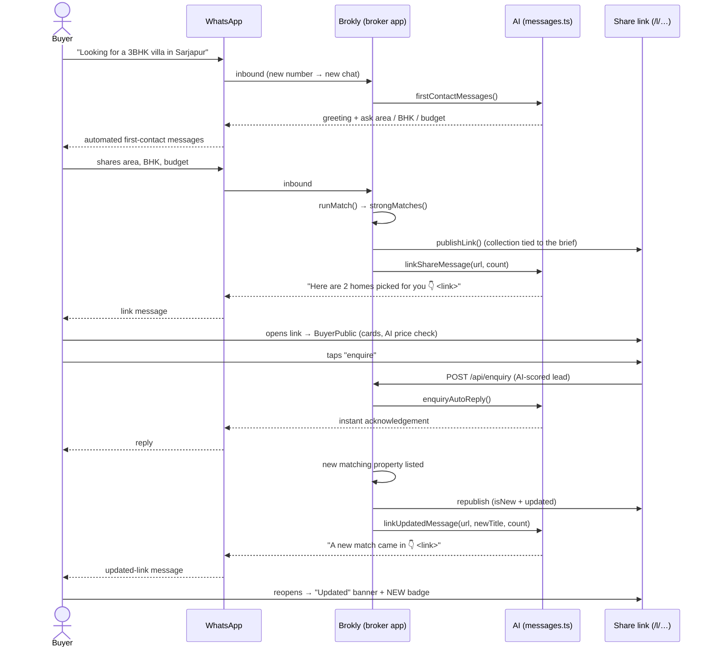

# Customer journey — the buyer side of Brokly

How a property buyer experiences Brokly end-to-end: the messages they get on first
contact, the public link screen they browse, how the AI drafts chat replies, and how a
smart-collection link keeps updating itself (with a WhatsApp nudge each time).

All buyer-facing copy lives in one place — [`src/lib/messages.ts`](../src/lib/messages.ts) —
so it can be reused by the client store and the API routes and unit-tested in isolation.
Examples below use the seeded client **Rajesh Iyer** (3BHK Villa in Sarjapur, ₹1.6–1.9 Cr) and
broker **Ammar Khan / Ammar Estates**.

_Source: [`diagrams/buyer-journey.mermaid`](./diagrams/buyer-journey.mermaid)._

## 1. First interaction — the messages a buyer receives

The moment an unknown number messages the broker, `ingestInbound` in
[`src/lib/store.ts`](../src/lib/store.ts) creates the chat and auto-replies with
`firstContactMessages()` so the buyer is never left waiting:

> Hi Rajesh! 👋 This is Ammar Khan from Ammar Estates. Thanks for reaching out.
>
> I'll line up the best-matching homes for you. Could you share three quick things?
> 📍 Preferred area · 🛏 BHK · 💰 Budget
>
> Or just tell me what you're looking for in your own words — I'll take it from there.

Once the broker captures the brief, `briefAckMessage()` confirms it before matches go out:

> Perfect — 3BHK Villa in Sarjapur, ₹1.6 Cr–₹1.9 Cr. Curating your matches now… ⏳

> **Live vs demo:** sends are simulated until WhatsApp Cloud API credentials are set (see
> `WHATSAPP_SETUP.md`). In demo mode the first-contact reply is written straight into the chat
> thread; in live mode the webhook route should also dispatch it through the send API.

## 2. How the AI chats

`suggestReplies(conversation)` reads the last inbound message and offers up to three
context-aware drafts in the Inbox composer (broker taps one to load it, edits, sends):

- **Brand-new chat, no reply yet** → opens with a first-contact greeting and a request for the brief.
- **"visit / weekend / Saturday"** → "Saturday 11am works — shall I confirm the visit?"
- **"parking"** → "Yes, 2 covered car parks are included."
- **"price / budget / offer"** → "The owner can consider a fair offer — what number works for you?"
- **"loan / EMI / bank"** → offers home-loan help.
- **"documents / registration / khata / title"** → confirms papers are clear.
- **"available / sold"** → confirms availability and offers a slot.
- **"co-broke / 50 / split"** → agrees the split and sends the agreement.
- **Fallback** → "Sharing the details now 👍" / "Can you share your budget & timeline?"

This is a deterministic, rules-based drafter (no model call), so it's instant and testable. The
floating **Assistant** answers free-form questions over live data separately.

## 3. The customer screen (`/l/…`)

A share link opens [`src/app/l/[...slug]/page.tsx`](../src/app/l/%5B...slug%5D/page.tsx), which
resolves the published snapshot from the link store and renders
[`BuyerPublic`](../src/components/BuyerPublic.tsx). The buyer sees, in a phone-width layout:

- A header — "Homes picked for you", "Shared by Ammar Estates".
- One card per matched home with a **"NN% for you"** match score, price (₹ short form), area,
  BHK and sqft.
- A detail view per home: photo, price + per-sqft, key specs, an **AI price check**, a **stamp-duty
  estimate**, the broker's card, and an **"I'm interested — enquire"** button.
- An enquiry sheet (name / phone / message).

There is no login and no broker data leakage — only the resolved property snapshot is published.

## 4. Enquiry → instant reply → AI-scored lead

Submitting the enquiry form POSTs to
[`src/app/api/enquiry/route.ts`](../src/app/api/enquiry/route.ts). Two things happen:

1. The buyer gets an **instant WhatsApp acknowledgement** via `enquiryAutoReply()`:

   > Thanks Rajesh! I've noted your interest in 3BHK Villa · Adarsh Palm. This is Ammar Khan —
   > would you like to visit this weekend? I can hold a slot 🗓

2. The broker's app ingests the enquiry and scores it HOT / WARM / COLD (`addEnquiry` in the
   store), tying it back to the property and the originating link.

## 5. How the link updates — and the updated-link message

A **smart collection** link is bound to the client's brief, not a fixed list. The published
payload is recomputed from `strongMatches(properties, req)` (see
[`src/lib/matching.ts`](../src/lib/matching.ts)), so whenever matching stock changes the link's
contents change.

When a new matching property is listed (`simulateNewStock` in the store demonstrates this):

1. The collection link is **republished** — the freshly added home is flagged `isNew` and the
   payload's `updated` timestamp moves past `created`.
2. The tied client is messaged with `linkUpdatedMessage()` (written to the chat thread and, in
   live mode, sent via the WhatsApp API):

   > Good news Rajesh! A new match just came in — 3BHK Villa · Sobha Lifestyle. Your collection is
   > now 3 homes 👇
   > https://brokly.app/l/c/rajesh-iyer-…

3. When the buyer reopens the same link, `BuyerPublic` shows an **"Updated" banner** and the new
   card carries a **✦ NEW** badge — no new link, same URL.

## Where it lives

| Concern | File |
| --- | --- |
| All buyer copy + AI reply drafter | `src/lib/messages.ts` |
| First-contact auto-reply, updated-link message, republish | `src/lib/store.ts` |
| Inbox suggestions | `src/components/screens/Inbox.tsx` |
| Customer screen | `src/components/BuyerPublic.tsx`, `src/components/buyer-view.tsx` |
| Link route + published snapshot | `src/app/l/[...slug]/page.tsx`, `src/lib/link-store.ts` |
| Enquiry + instant reply | `src/app/api/enquiry/route.ts` |
| Match ranking | `src/lib/matching.ts` |
