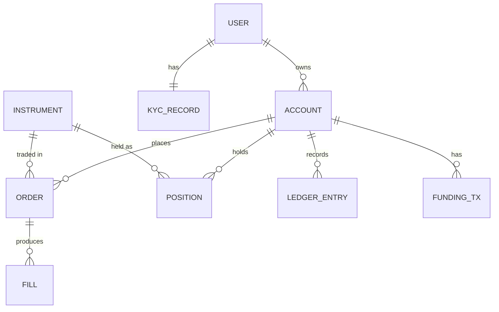

# Data model

> ⚠️ **Superseded.** This is the early **stock-brokerage** data model (accounts, orders, fills) —
> not the real product. Brokly is a **real-estate CRM**; the live domain types are in
> `src/lib/types.ts`. The money rule still holds: all amounts are integer **paise**
> (`src/lib/money.ts`), never floats.

_Source: [`diagrams/data-model.mermaid`](./diagrams/data-model.mermaid)._

## Entities

**USER** — a person. Owns one or more accounts and exactly one KYC record.

**KYC_RECORD** — verification status and the external provider reference. Trading and funding are
gated on `status = verified`.

**ACCOUNT** — a tradable account with a base currency and a cash balance. `cash_balance_minor` is a
cached projection of the ledger, not the source of truth.

**INSTRUMENT** — a tradable asset (symbol, asset class, `price_scale` for minor-unit conversion).

**ORDER** — an instruction to buy/sell. Carries side, type (market/limit), quantity, optional limit
price, and a status that follows the order lifecycle state machine.

**FILL** — an execution against an order. An order can have many fills (partial executions).

**POSITION** — current holding of an instrument in an account, with quantity and average cost.

**LEDGER_ENTRY** — one leg of a double-entry record (deposits, withdrawals, trade cash movements,
fees). The ledger is the source of truth for cash.

**FUNDING_TX** — a deposit or withdrawal request and its processor status; posts ledger entries on
settlement.

## Invariants

- Cash balance for an account equals the sum of its ledger entries. A reconciliation job asserts
  this and alerts on drift.
- A position's quantity equals the signed sum of its fills; average cost recomputes on each buy.
- No order routes without a prior successful risk/balance check.
- Every write that moves money is idempotent on an idempotency key or event id.

## Notes for implementation

Use Prisma with a `schema.prisma` mirroring the entities above. Add indexes on the foreign keys
used in hot paths (`order.account_id`, `fill.order_id`, `ledger_entry.account_id`) and on
`instrument.symbol`. Keep an append-only audit table separate from these operational tables.
